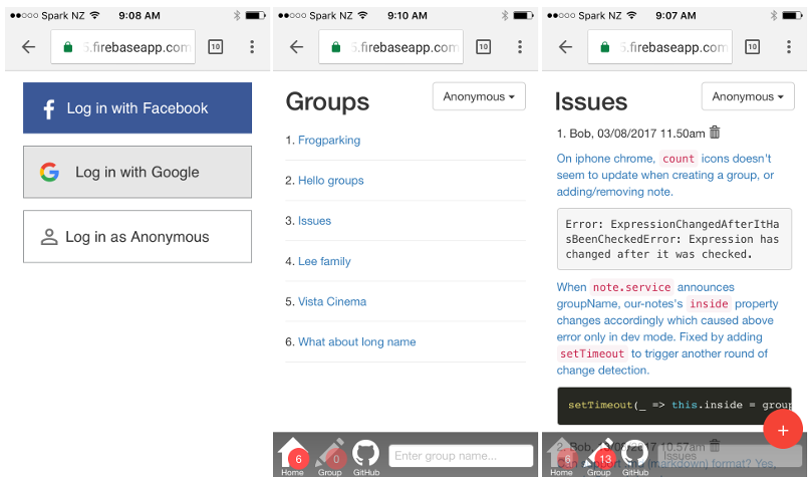

# Our Notes

This SPA(single-page app) allows to maintain notes by group. Each note can have an optional image from your camera, storage or cloud. ~~This app supports PWA(progressive web app) using `@angular/service-worker` so you will enjoy native app-like look and feel, offline capability, better performance.~~



The project was built and deployed using following technologies:
* [Angular](https://angular.io/): frontend framework
* [Angular Firebase](https://github.com/angular/angularfire2): Angular library for Firebase
* [Firebase](https://firebase.google.com/): cloud platform for hosting, authentication, database and storage
* [Workbox](https://workboxjs.org/): JavaScript libraries for Progressive Web Apps

Visit [the web](https://ng-notes-abb75.firebaseapp.com/) and play with it! You would need to log in first ~~as anonymous or~~ using your Facebook or Google account.

For development, clone the repo and run `yarn` to install dependencies, then `ng serve`.

```
// to install dependencies
yarn
// to debug on localhost:4200
ng serve
// to run tests
ng test
// to build for production
npm run build:workbox
// to test on localhost:5000 with production build
npm run serve
```
